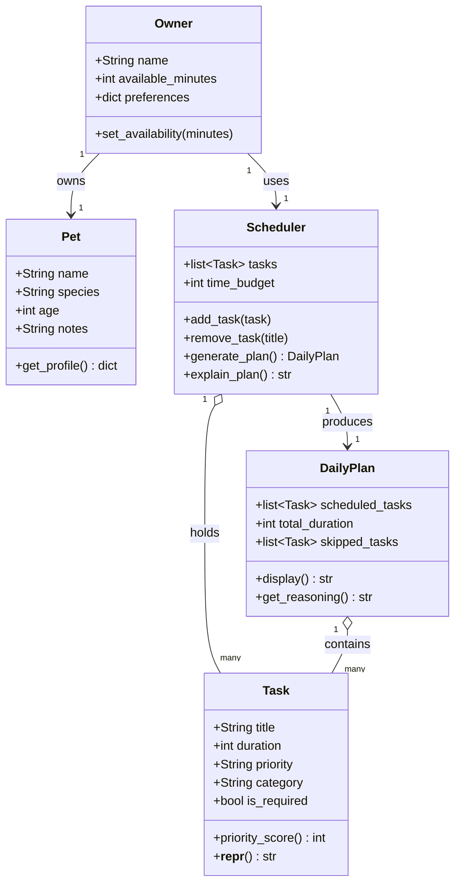

# PawPal+ Project Reflection

## 1. System Design

Three core actions a user should be able to perform:

1. Enter owner + pet profile
The user provides basic context: their name, the pet's name, species, and available time for the day. This feeds constraints into the scheduler so the plan is personalized.

2. Add / manage care tasks
The user creates tasks with at minimum a title, duration (minutes), and priority (low/medium/high). This is the task list the scheduler draws from — walks, feeding, meds, grooming, etc.

3. Generate and view a daily schedule
The user triggers the scheduler, which selects and orders tasks based on priority and time constraints, then displays the resulting plan with reasoning (e.g., "Morning walk scheduled first because it's high priority and takes 20 min").

**a. Initial design**

- Briefly describe your initial UML design.

The initial design centered on five classes: **Owner**, **Pet**, **Task**, **Scheduler**, and **DailyPlan**. Owner holds the user's name and daily time budget; Pet stores the animal's profile (name, species, age, notes). Task represents a single care activity with a title, duration, priority, category, and a flag for whether it is required. Scheduler owns the task pool and the time budget, and is responsible for selecting and ordering tasks. DailyPlan is the output of the scheduler — it holds the accepted tasks, the skipped tasks, and the total duration. Owner associates with one Pet and one Scheduler; Scheduler produces one DailyPlan; both Scheduler and DailyPlan aggregate many Tasks.

<!-- add mermaid diagram here -->

- What classes did you include, and what responsibilities did you assign to each?

The classes and their responsibilities are as follows:
- **Owner**: Stores the user's name, available time for pet care, and any preferences. Responsible for setting availability and providing context for scheduling.
- **Pet**: Stores the pet's name, species, age, and notes. Responsible
for providing a profile that can inform task selection (e.g., a dog might have different care needs than a cat).
- **Task**: Represents a single care activity with attributes for title, duration, priority,
category, and whether it is required. Responsible for calculating a priority score and providing a string representation.
- **Scheduler**: Holds the list of tasks and the time budget. Responsible for adding/removing tasks, generating a daily plan based on constraints and priorities, and explaining the reasoning behind the plan.
- **DailyPlan**: Contains the scheduled tasks, total duration, and any skipped tasks.
Responsible for displaying the plan and providing reasoning for task selection.

**b. Design changes**

- Did your design change during implementation?
- If yes, describe at least one change and why you made it.

Yes. The most significant change was to `Scheduler`: the initial design had it take only a `time_budget` integer, but during review it became clear that the scheduler had no access to the owner's preferences or the pet's profile, making personalized scheduling impossible. `Scheduler` was updated to accept `owner` and `pet` directly, and `time_budget` was converted to a `@property` that reads from `owner.available_minutes` — this also eliminated the risk of the budget drifting out of sync if the owner's availability changed after the scheduler was created.

---

## 2. Scheduling Logic and Tradeoffs

**a. Constraints and priorities**

- What constraints does your scheduler consider (for example: time, priority, preferences)?
- How did you decide which constraints mattered most?

**b. Tradeoffs**

- Describe one tradeoff your scheduler makes.
- Why is that tradeoff reasonable for this scenario?

---

## 3. AI Collaboration

**a. How you used AI**

- How did you use AI tools during this project (for example: design brainstorming, debugging, refactoring)?
- What kinds of prompts or questions were most helpful?

**b. Judgment and verification**

- Describe one moment where you did not accept an AI suggestion as-is.
- How did you evaluate or verify what the AI suggested?

---

## 4. Testing and Verification

**a. What you tested**

- What behaviors did you test?
- Why were these tests important?

**b. Confidence**

- How confident are you that your scheduler works correctly?
- What edge cases would you test next if you had more time?

---

## 5. Reflection

**a. What went well**

- What part of this project are you most satisfied with?

**b. What you would improve**

- If you had another iteration, what would you improve or redesign?

**c. Key takeaway**

- What is one important thing you learned about designing systems or working with AI on this project?
