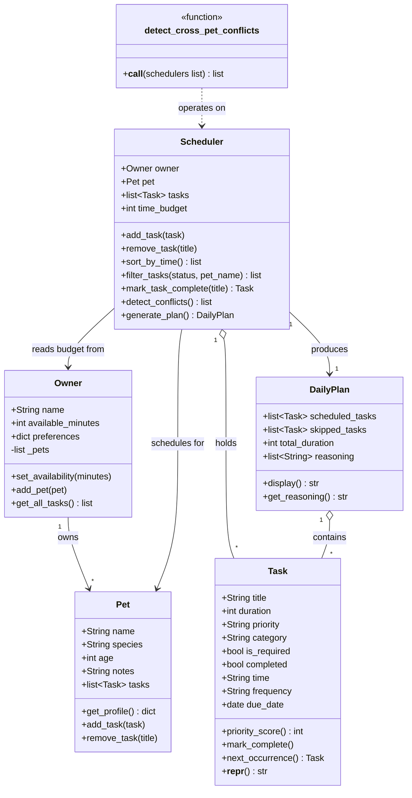

# PawPal+ Project Reflection

## 1. System Design

Three core actions a user should be able to perform:

1. Enter owner + pet profile
The user provides basic context: their name, the pet's name, species, and available time for the day. This feeds constraints into the scheduler so the plan is personalized.

2. Add / manage care tasks
The user creates tasks with at minimum a title, duration (minutes), and priority (low/medium/high). This is the task list the scheduler draws from — walks, feeding, meds, grooming, etc.

3. Generate and view a daily schedule
The user triggers the scheduler, which selects and orders tasks based on priority and time constraints, then displays the resulting plan with reasoning (e.g., "Morning walk scheduled first because it's high priority and takes 20 min").

**a. Initial design**

- Briefly describe your initial UML design.

The initial design centered on five classes: **Owner**, **Pet**, **Task**, **Scheduler**, and **DailyPlan**. Owner holds the user's name and daily time budget; Pet stores the animal's profile (name, species, age, notes). Task represents a single care activity with a title, duration, priority, category, and a flag for whether it is required. Scheduler owns the task pool and the time budget, and is responsible for selecting and ordering tasks. DailyPlan is the output of the scheduler — it holds the accepted tasks, the skipped tasks, and the total duration. Owner associates with one Pet and one Scheduler; Scheduler produces one DailyPlan; both Scheduler and DailyPlan aggregate many Tasks.

<!-- add mermaid diagram here -->

- What classes did you include, and what responsibilities did you assign to each?

The classes and their responsibilities are as follows:
- **Owner**: Stores the user's name, available time for pet care, and any preferences. Responsible for setting availability and providing context for scheduling.
- **Pet**: Stores the pet's name, species, age, and notes. Responsible
for providing a profile that can inform task selection (e.g., a dog might have different care needs than a cat).
- **Task**: Represents a single care activity with attributes for title, duration, priority,
category, and whether it is required. Responsible for calculating a priority score and providing a string representation.
- **Scheduler**: Holds the list of tasks and the time budget. Responsible for adding/removing tasks, generating a daily plan based on constraints and priorities, and explaining the reasoning behind the plan.
- **DailyPlan**: Contains the scheduled tasks, total duration, and any skipped tasks.
Responsible for displaying the plan and providing reasoning for task selection.

**b. Design changes**

- Did your design change during implementation?
- If yes, describe at least one change and why you made it.

Yes. The most significant change was to `Scheduler`: the initial design had it take only a `time_budget` integer, but during review it became clear that the scheduler had no access to the owner's preferences or the pet's profile, making personalized scheduling impossible. `Scheduler` was updated to accept `owner` and `pet` directly, and `time_budget` was converted to a `@property` that reads from `owner.available_minutes` — this also eliminated the risk of the budget drifting out of sync if the owner's availability changed after the scheduler was created.

---

## 2. Scheduling Logic and Tradeoffs

**a. Constraints and priorities**

The scheduler considers three constraints: the owner's daily time budget (`available_minutes`), task priority (`low / medium / high`), and whether a task is required. Time budget is the hard outer limit — it determines what can even be considered. Within that, `is_required` takes precedence over priority score, because missing a required task (e.g., medication) has real consequences. Priority then breaks ties among optional tasks, with higher scores scheduled first. Start time (`time`) is a fourth, softer constraint used for conflict detection and display ordering rather than scheduling inclusion.

Time budget was treated as the most important constraint because it is the one resource that cannot be extended — you can deprioritize a walk, but you cannot add hours to the day.

**b. Tradeoffs**

The scheduler uses a greedy first-fit strategy: it iterates tasks in priority order and schedules each one if it fits in the remaining time. This means a large high-priority task can consume most of the budget and block several smaller lower-priority tasks that would collectively deliver more value. The alternative — an optimal knapsack search — is more accurate but exponentially slower and harder to explain to users. The greedy approach is reasonable here because pet care tasks are few (typically under 20) and owners benefit more from a transparent, predictable plan than from a mathematically optimal one they cannot reason about.

---

## 3. AI Collaboration

**a. How you used AI**

AI was used at three stages: initial class design (brainstorming what responsibilities each class should own), generating edge-case test scenarios (e.g., adjacent tasks that touch but don't overlap, recurring tasks completed twice), and updating the Streamlit UI to wire new backend methods into the display. The most helpful prompt pattern was providing the actual code and asking "what is missing or inconsistent" rather than asking for general advice — concrete inputs produced concrete, actionable suggestions.

**b. Judgment and verification**

When AI suggested adding `detect_cross_pet_conflicts` as a method on `Scheduler`, I chose to keep it as a standalone module-level function instead. A method on `Scheduler` would only have access to one scheduler's tasks, requiring an awkward `other_schedulers` parameter and making the single-responsibility boundary unclear. The standalone function naturally accepts a list of schedulers and keeps `Scheduler` focused on one pet. I verified the decision by checking that the function signature and the call sites in tests remained clean with no circular references.

---

## 4. Testing and Verification

**a. What you tested**

The test suite covers: task creation validation (invalid priority/frequency raise `ValueError`), sorting correctness (`sort_by_time` returns chronological order with untimed tasks trailing), recurrence logic (`mark_task_complete` on a daily task produces a new task with `due_date + 1 day`), conflict detection (overlapping windows flagged, adjacent boundary not flagged, completed tasks excluded), plan generation (required tasks always scheduled even over budget, optional tasks skipped when time runs out), and cross-pet conflict detection (same pet name not double-flagged, empty scheduler list returns safely).

These tests matter because the scheduler's output directly affects a pet's care routine — a silent bug in priority ordering or recurrence could mean a medication task gets skipped every day without the owner noticing.

**b. Confidence**

High confidence for the core scheduling and conflict detection logic — every significant branch has a test. The main gap is the double-complete edge case: completing a recurring task twice silently adds two next-occurrence copies, which is likely unintended. Next I would test `filter_tasks` with combined `status` + `pet_name` filters, and add a test that verifies the scheduler's total duration never exceeds the budget for optional-only task lists.

---

## 5. Reflection

**a. What went well**

The `time_budget` as a `@property` reading from `owner.available_minutes` is the design decision I am most satisfied with. It eliminated an entire class of potential bugs where the scheduler's budget could drift out of sync with the owner's actual availability, and it made the relationship between `Owner` and `Scheduler` explicit without requiring `Owner` to hold a reference back to `Scheduler`.

**b. What you would improve**

The `generate_plan` method mixes scheduling logic with reasoning string construction in a single loop, making it harder to test the scheduling decisions in isolation from the explanation text. In the next iteration I would separate those two concerns — a pure `_select_tasks()` method that returns scheduled/skipped lists, and a separate layer that generates the reasoning strings from those results.

**c. Key takeaway**

Designing the interface before the implementation forces clarity that writing code first does not. Deciding what each class is responsible for — and what it is explicitly not responsible for — made every subsequent implementation choice easier and made AI suggestions easier to evaluate, because there was a clear standard to check them against.
